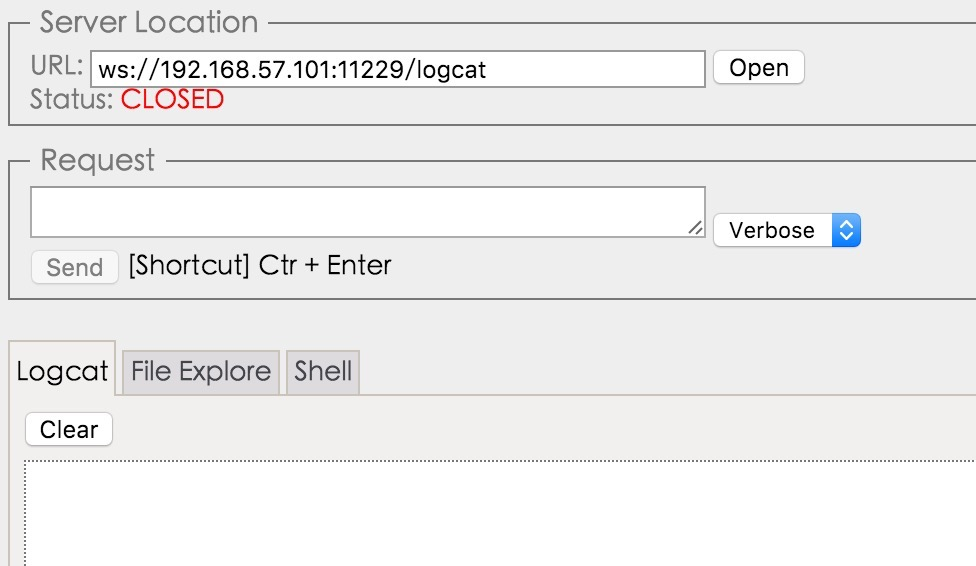

# RemoteLogcatViewer
在浏览器上远程查看logcat日志。

## 用法
```gradle
compile project(':remotelogcat')
```

```java
//start
LogcatRunner.getInstance().start();
...
//stop
LogcatRunner.getInstance().stop();
```

然后在浏览器中打开<a href="http://8enet.github.io/RemoteLogcatViewer/" target="_blank">index.html</a> 输入对应局域网ip和端口`ws://ip:port/logcat` 即可(注:logcat别名可以修改)。


如果不希望修改现有项目，可以新建一个其他的项目依赖本库，然后通过配置相同的 `android:sharedUserId=""` 和签名相同，
可以在新app运行时中读取所有sharedUserId相同的 log。

## 实现原理
原理非常简单，在内部使用`Runtime.getRuntime().exec("logcat");` 执行命令去获取logcat输出流，然后逐行读取后通过websocket输出要远端，为了尽可能节省性能，只会维护一个客户端输出。   
注意只能输出自己包下的log日志，当然相同sharedUserId和签名的也可以，多进程情况下建议在常驻后台的Service中启动本监听。

## 作用
某些Android设备没有调试接口，比如电视或者各种盒子终端，没法连接usb调试当然也不能查看logcat日志了，这个项目是在浏览器上远程显示和保存logcat输出，帮助调试开发使用。

## 功能
目前可以完整的查看、过滤、保存logcat信息。
支持日志文件写入、下载。  
后期会加入shell支持。

## License
Apache License 2.0
