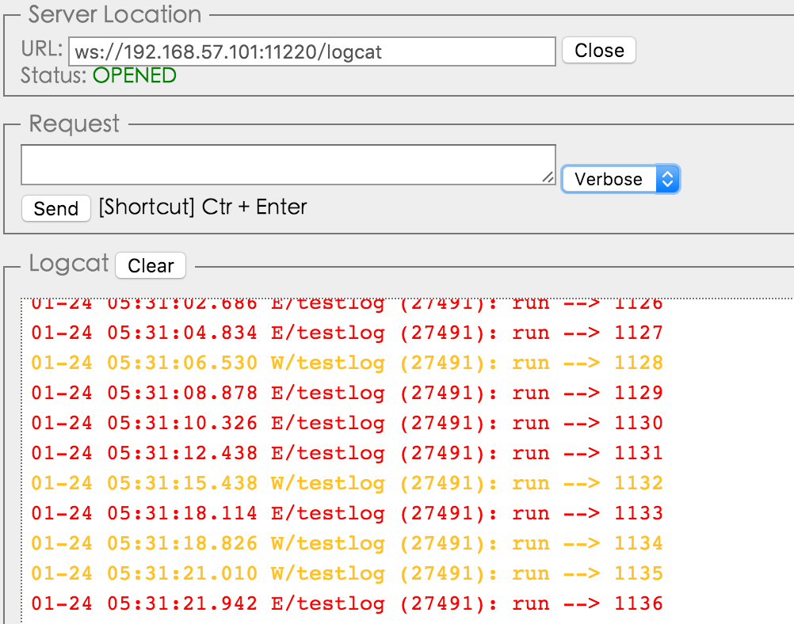

# RemoteLogcatViewer
在浏览器上远程查看logcat日志。

## 用法
```gradle
compile project(':remotelogcat')
```

```java
//start
LogcatRunner.getInstance().start();
...
//stop
LogcatRunner.getInstance().stop();
```
然后在浏览器中打开<a href="http://8enet.github.io/RemoteLogcatViewer/" target="_blank">index.html</a> 输入对应局域网ip和端口`ws://ip:port/logcat` 即可。


## 实现原理
原理非常简单，在内部使用`Runtime.getRuntime().exec("logcat");` 执行命令去获取logcat输出流，然后逐行读取后通过websocket输出要远端，为了尽可能节省性能，只会维护一个输出。   
注意只能输出自己包下的log日志，多进程情况下建议在常驻后台的Service中启动本监听。

## 作用
某些Android设备没有调试接口，比如电视或者各种盒子终端，没法连接usb调试当然也不能查看logcat日志了，这个项目是在浏览器上远程显示logcat输出，帮助调试开发使用。

## 感谢
[AndroidAsync](https://github.com/koush/AndroidAsync)

## License
Apache License 2.0
